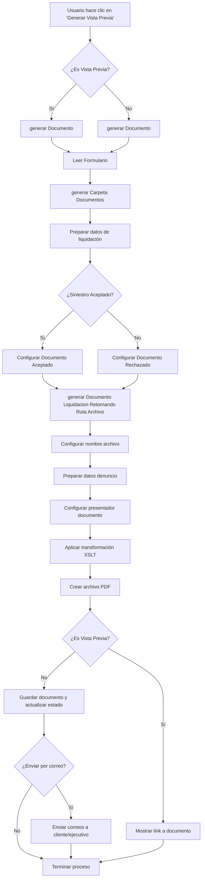

```mermaid
flowchart TD
    A[Usuario hace clic en 'Generar Vista Previa'] --> B{¿Es Vista Previa?}
    B --> |Sí| C[generar Documento]
    B --> |No| D[generar Documento]
    
    C --> E[Leer Formulario]
    D --> E
    
    E --> F[generar Carpeta Documentos]
    F --> G[Preparar datos de liquidación]
    
    G --> H{¿Siniestro Aceptado?}
    
    H -- Sí --> I[Configurar Documento Aceptado]
    H -- No --> J[Configurar Documento Rechazado]
    
    I --> K[generar Documento Liquidacion Retornando Ruta Archivo]
    J --> K
    
    K --> L[Configurar nombre archivo]
    L --> M[Preparar datos denuncio]
    M --> N[Configurar presentador documento]
    N --> O[Aplicar transformación XSLT]
    O --> P[Crear archivo PDF]
    
    P --> Q{¿Es Vista Previa?}
    
    Q -- Sí --> R[Mostrar link a documento]
    Q -- No --> S[Guardar documento y actualizar estado]
    
    S --> T{¿Enviar por correo?}
    T -- Sí --> U[Enviar correos a cliente/ejecutivo]
    T -- No --> V[Terminar proceso]
    
    U --> V
    R --> V
```
